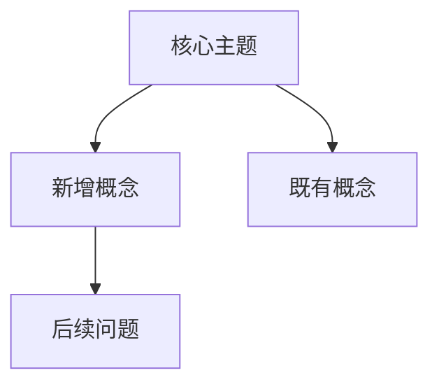

# 05 Concept Map Delta Template

One file per update batch.

## Filename

```text
[YYYY-MM-DD]-[source-or-batch-slug]-05-concept-map-delta.md
```

## Purpose

- Track conceptual changes caused by the update
- Identify new nodes, strengthened nodes, and new relationships
- Make the notebook's knowledge graph evolve over time

## Recommended Structure

```markdown
---
source: NotebookLM
notebook_id: [notebook-id]
notebook_title: [notebook-title]
processed_by: Codex / Claude Code
run_id: [run-id]
created: YYYY-MM-DD
output_type: 05-concept-map-delta
---

# 概念图谱变化

## 新增概念

- **[概念]**：[说明]

## 被强化的旧概念

- **[概念]**：[新增来源如何强化它]

## 新关系

- **[概念 A] → [概念 B]**：[关系说明]

## 仍然薄弱或缺失的节点

- [还缺材料、证据不足、定义不清的概念]

## Mermaid 概念图



## 可吸收进 wiki 的候选项

- Concepts: [[候选概念]]
- Entities: [[候选实体]]
- Products: [[候选产品]]
- Comparisons: [[候选对比]]
```
