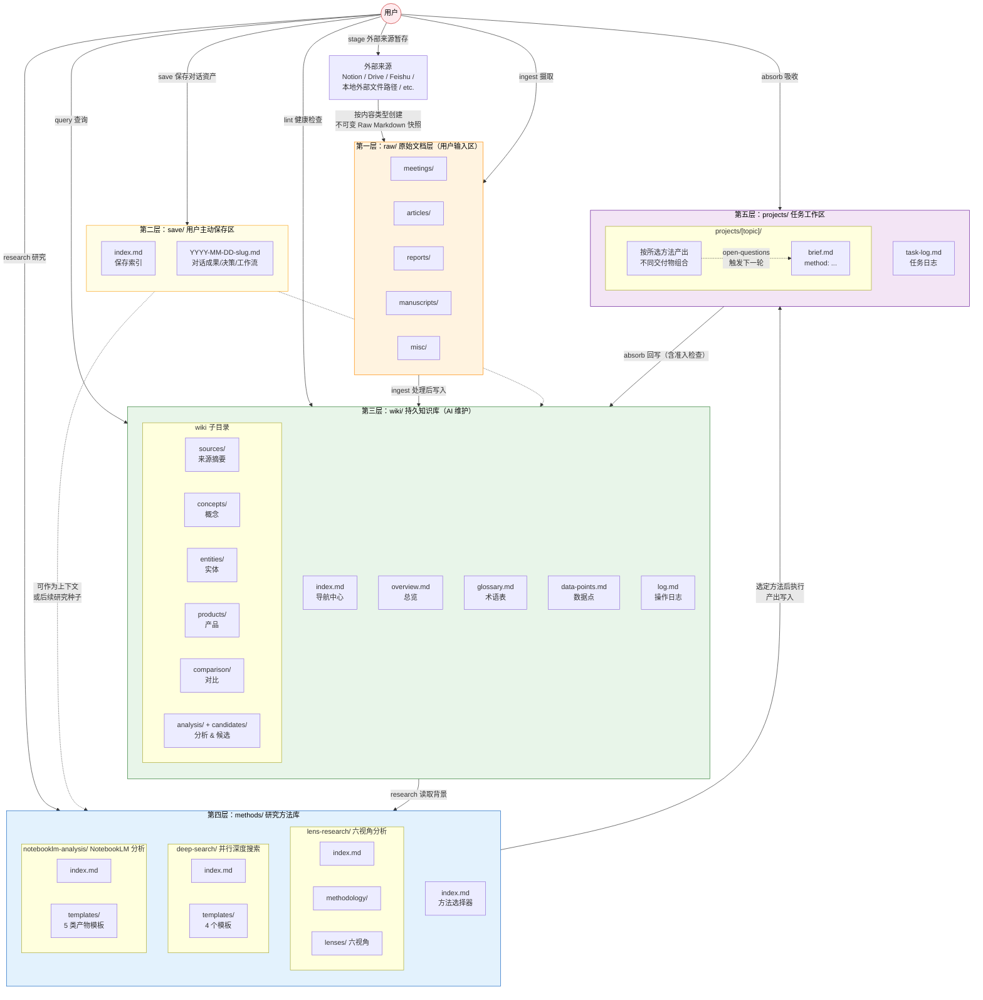
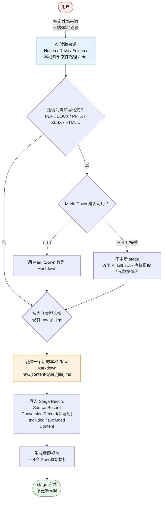
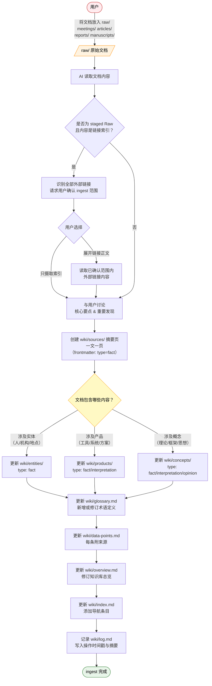
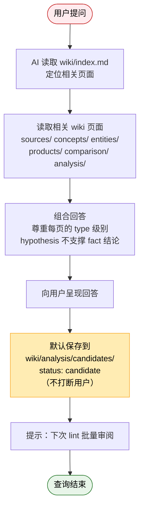
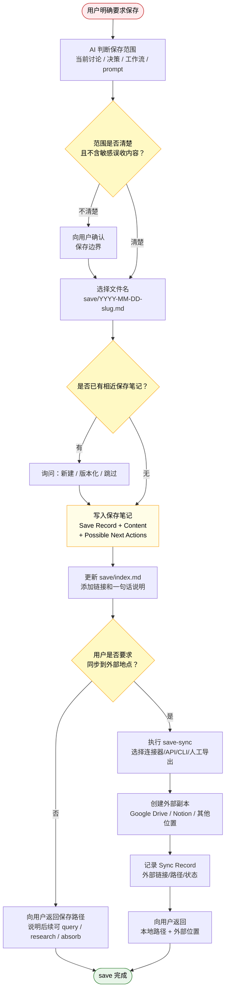
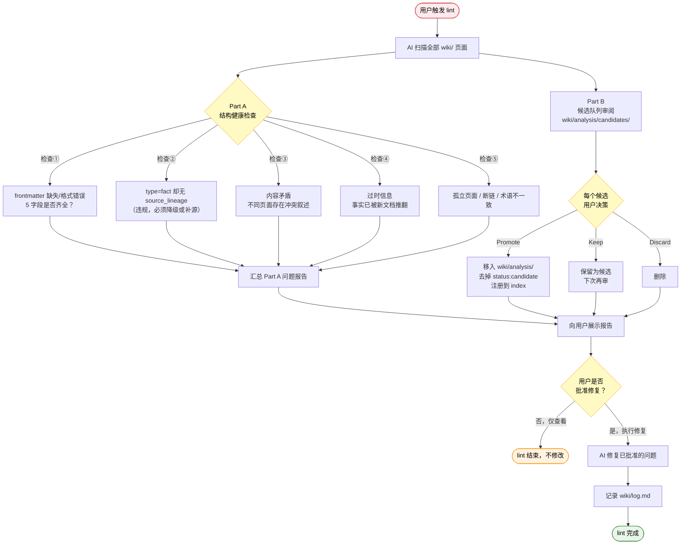
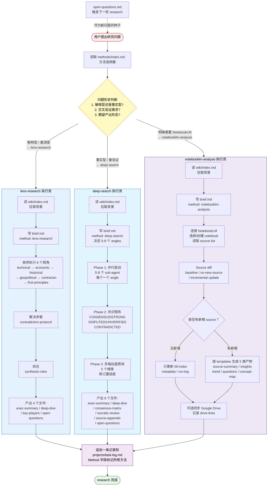
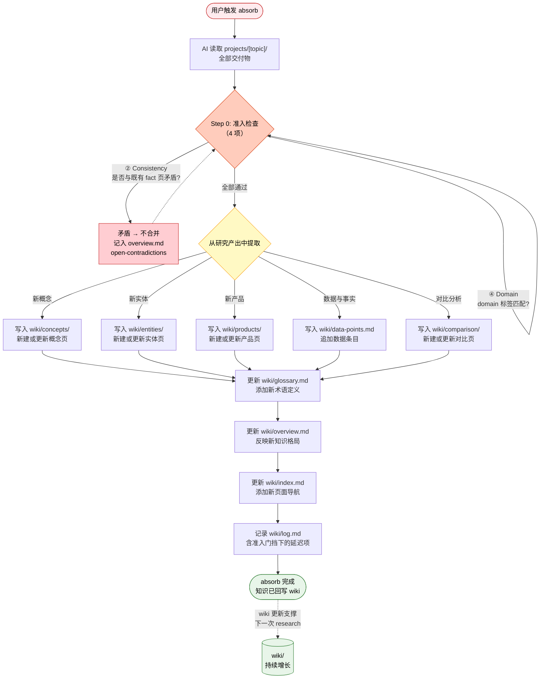

# 系统使用流程图

> 协议版本:**v2.0**(2026-05-07)。此文件描绘 5 层架构（raw / save / wiki / methods / projects）与 8 个操作（按 Input / Processing / Maintenance 三阶段分组）。完整变更见 `CLAUDE.md` 顶部 Changelog。

## 图1：总体架构

---

## 图2：Raw 来源处理流程

### 图2a：stage 外部来源暂存

**关键约束**:
- Raw 分类按**内容类型**，不按来源工具(Notion 手稿 → `raw/manuscripts/`，本地 PDF 报告 → `raw/reports/`)
- `stage` 只创建新的 Raw 文件，不更新 wiki
- Connector 选择顺序:**MCP connector → CLI → 浏览器自动化 → 人工导出 → 用户提供副本**(详见 CLAUDE.md `stage` 操作说明)
- 对 PDF / DOCX / PPTX / XLSX / HTML 等本地外部文件，MarkItDown 是优先增强工具；如果本机没有或转换失败，`stage` 不阻断，改用 fallback，并在 `Conversion Record` 里说明完整性与限制
- 转写结果直接写入唯一的 Raw Markdown 文件，不额外保留中间转换稿，除非用户明确要求
- 创建前必须 dedup 检查;同源已存在则询问用户(replace / new versioned snapshot / skip)
- 文件命名:`[YYYY-MM-DD]-[slug](-v[N]).md`;首次快照不带 `-v`，第二次起加 `-v2` `-v3` ...
- 文件创建后视为**不可变**;后续 AI 操作只读不写;后续使用记录写入 `wiki/log.md`、`wiki/sources/` 或项目 source appendix

**关键约束**:每个新页必须带 5 字段 frontmatter（id / domain / type / source_lineage / last_updated）。无可追溯来源证据不得标 `fact`。manuscripts 默认标 `opinion`。LLM 生成的 raw 文件不构成 fact 证据，除非由非 LLM 一手或权威来源独立验证（详见 CLAUDE.md `Fact Promotion Rules` 段）。

---

## 图3：query 查询操作（候选晶化流程）

---

## 图3b：save 保存操作（用户主动收藏流程）

**关键约束**:
- `save/` 只保存用户明确要求保存的对话资产，不自动捕获所有对话
- 外部原始资料仍走 `stage → raw/`
- 结构化研究仍走 `research → projects/`
- 长期知识沉淀仍需审阅后进入 `wiki/`
- `save/` 内容本身不构成 `type: fact` 证据
- 外部同步是单向副本：`save/` → Google Drive / Notion / 其他位置
- 本地 `save/` 始终是主记录；v1 不处理外部回写和 merge

---

## 图4：lint 健康检查操作（结构 + 候选审阅）

---

## 图5：research 研究操作（方法选择 + 分支执行）

---

## 图6：absorb 吸收操作（知识闭环 + 准入检查）

